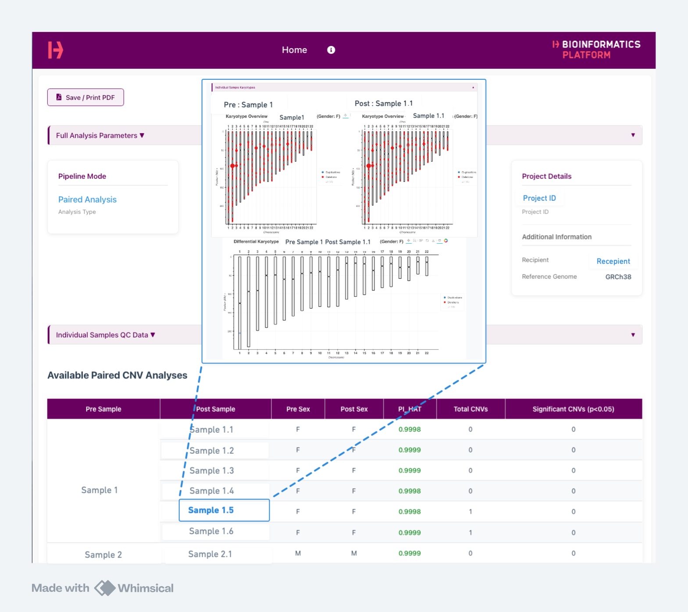
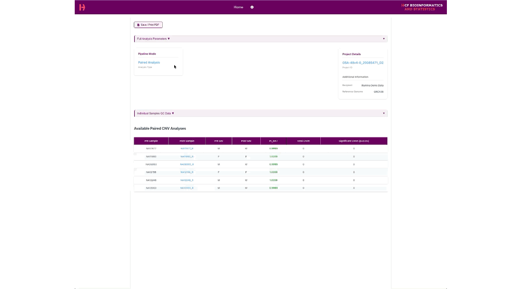
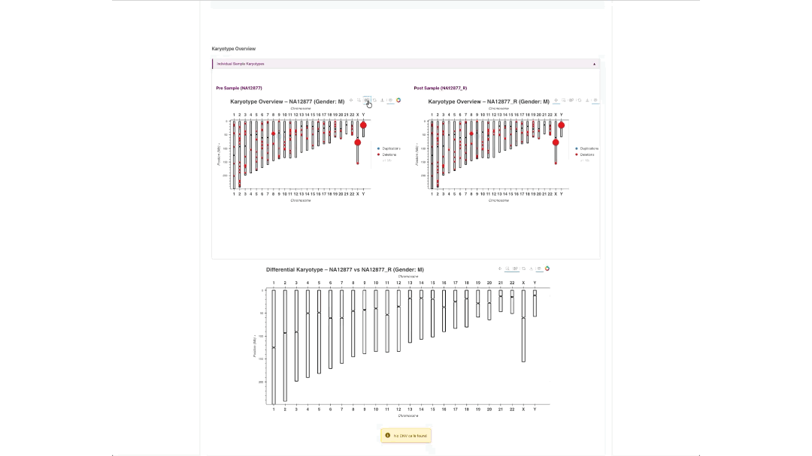

# KaryoExplorer: An Automated Digital Karyotyping Pipeline with Interactive Visualizations

[](https://www.nextflow.io/)
[](https://opensource.org/licenses/MIT)
[](https://doi.org/10.5281/zenodo.XXXXXXX)
[](https://docs.conda.io/)
[](https://www.docker.com/)
[](https://sylabs.io/docs/)

A Nextflow-based, containerized pipeline for copy number variation (CNV) and loss of heterozygosity (LoH) analysis from Illumina genotyping arrays, with interactive HTML-based visualization through KaryoExplorer.

---

## Summary

This digital karyotyping pipeline detects de novo copy number abnormalities arising in cultured cell lines, i.e., to determine differences between cell lines and the starting material from which they were derived in terms of copy number variation. The genomic screening for chromosomal abnormalities can be used as quality control to establish and maintain stem cell lines.


**KaryoExplorer** standardizes this workflow into a single, reproducible pipeline that:
- Performs CNV and LoH analysis from Illumina Infinnium genotyping array data
- Detects copy-neutral LoH (cnLoH) by overlaying runs of homozygosity with copy number states
- Generates self-contained, interactive HTML reports with synchronized BAF/LRR/CN visualizations
- Enables offline browsing with no additional software requirements
- Ensures reproducibility through Nextflow's containerized workflow management

<div align="center">
  
  
  <br>
  <em>Figure 1: Self-contained interactive report displaying navigation menu, QC summary metrics, and sample overview for paired analysis (left). Interactive demonstration of the illumina data results, dropdown features and navigation. Source: Illumina 2024 Infinium Global Screening Array v4.0 Used under license from Illumina, Inc. All Rights Reserved (right).</em>
</div>


---

## Key Features

### Analysis Capabilities
- **Dual Analysis Modes**: Single-sample and paired (PRE→POST) analysis with differential views
- **CNV Detection**: Deletions and duplications from BAF/LRR segmentation using bcftools cnv algorithm
- **LoH Detection**: Runs of homozygosity (ROH) identification using bcftools roh algorithm
- **cnLoH Classification**: Automatic detection of copy-neutral LoH (CN=2 ∩ ROH) and copy-loss LoH (CN<2 ∩ ROH)
- **Quality Control**: Detailed QC metrics, IBD analysis, and sample matching

### Interactive Visualization (KaryoExplorer)
- **Multi-page HTML application**: Genome-wide karyograms with synchronized chromosome views
- **Interactive plots**: Pan-and-zoom BAF/LRR/CN tracks with Bokeh integration
- **cnLoH highlighting**: Visual identification of candidate copy-neutral LoH regions
- **Export capabilities**: Per-page Print-to-PDF preserving current zoom/selection; built-in PNG export for publication
- **Searchable tables**: Filterable, sortable CNV and LoH event tables with export functions


*Figure 2: Synchronized PRE (donor) and POST (iPSC) karyograms. CNV segments are color-coded (deletions in blue, duplications in red) with size indicating magnitude and opacity reflecting statistical significance. Source: Illumina 2024 Infinium Global Screening Array v4.0 Used under license from Illumina, Inc. All Rights Reserved.*


*Figure 3: Interactive chromosome-level BAF, LRR, and copy number tracks in paired mode. ROH segments and candidate cnLoH regions are highlighted. LRR plots overlay segment boundaries and mean values to aid deviation assessment. Source: Illumina 2024 Infinium Global Screening Array v4.0 Used under license from Illumina, Inc. All Rights Reserved.*

### Reproducibility & Scalability
- **Containerized execution**: Docker, Singularity/Apptainer support
- **Workflow management**: Nextflow DSL2 with automatic provenance tracking
- **HPC-ready**: SLURM configuration and templates with optimized resource allocation
- **Version control**: Automatic software version and parameter logging


---

## Installation

### System Requirements

 Minimum: 4 CPU cores, 16 GB RAM, 50 GB storage

#### Software Dependencies
- **Nextflow** ≥ 24.10.0 ([installation guide](https://www.nextflow.io/docs/latest/getstarted.html))
- **Java** ≥ 11 (required by Nextflow)
- **Container/Environment Manager** (choose one):
  - Docker ≥ 20.10 (recommended for local execution)
  - Conda/Mamba (for HPC clusters)
  - Apptainer (for HPC clusters)

### Supported Platforms


- **HPC Clusters** - SLURM configuration included 

- **Linux** (x86_64) 

- **Windows** (x86_64)

- **macOS** (Apple Silicon) - Supported via Docker with x86_64 emulation   

> **Note for Apple Silicon Users (M1/M2/M3):**  
> The pipeline uses Docker with `linux/amd64` platform emulation for compatibility with bioinformatics tools. Nextflow Wave automatically builds and caches containers. Successfully tested with demo dataset on MacBook Pro M1 with 16GB RAM using the `docker` profile.

### Quick Setup

**Conda Environment Setup**
```bash
# 1. Clone the repository
git clone https://github.com/Bioinformatics-Munich/KaryoExplorer.git
cd KaryoExplorer

# 2. Create environment with Nextflow and Java
conda env create -f env/karyoexplorer.yaml
conda activate karyoexplorer

# 3. Test installation
nextflow run main.nf --help
```

For detailed installation instructions, environment setup, and cluster configuration, see **[How_to_run.md](docs/How_to_run.md)**

---

## Quick Start

A detailed guide for testing the pipeline with the demo dataset is provided: **[Illumina Demo Dataset Guide (PDF)](docs/illumina_demo_dataset_guide.pdf)**.

You can test go through the guide and prepare and preprocess your own Illumina Infinnium Array output data in similar way. 

### Complete File Checklist

To be able to run the pipeline, you need to have following data. Before configuring the pipeline, verify you have all required files:

| Category | File Type | File Name/Description | Status |
|----------|-----------|----------------------|--------|
| **Genome Studio** | | | |
| | Full Data Table | `Full Data Table.txt` | ☐ |
| | Samples Table | `Samples Table.txt` | ☐ |
| | SNP Table | `SNP Table.txt` | ☐ |
| **PLINK Files** | | | |
| | PLINK Folder | `PLINK_[timestamp]/` directory | ☐ |
| | PED File | `*.ped` (inside PLINK folder) | ☐ |
| | MAP File | `*.map` (inside PLINK folder) | ☐ |
| | BED File | `*.bed` (inside PLINK folder) | ☐ |
| **Array Manifest** | | | |
| | Manifest CSV | `e.g GSA-48v4-0_20085471_D2.csv` | ☐ |
| **Reference Files** | | | |
| | Reference Genome (See Below) | `Homo_sapiens.GRCh38.dna.primary_assembly.fa` | ☐ |
| | PAR Coordinates | `PAR_Coord_GRCh38.txt` (or GRCh37) | ☐ |
| **Sample Sheet** | | | |
| | Sample Sheet (See Below) | `sample_sheet.txt` or `sample_sheet.xls` | ☐ |

### Downloading Reference Genomes

If you don't have the reference genome files, you can download them from Ensembl:

**GRCh38:**
```bash
# Download GRCh38
wget https://ftp.ensembl.org/pub/release-110/fasta/homo_sapiens/dna/Homo_sapiens.GRCh38.dna.primary_assembly.fa.gz

# Extract
gunzip Homo_sapiens.GRCh38.dna.primary_assembly.fa.gz
```

**GRCh37:**
```bash
# Download GRCh37
wget https://ftp.ensembl.org/pub/grch37/release-110/fasta/homo_sapiens/dna/Homo_sapiens.GRCh37.dna.primary_assembly.fa.gz

# Extract
gunzip Homo_sapiens.GRCh37.dna.primary_assembly.fa.gz
```

### Sample Sheet Preperation

**Analysis Types:**
- **Paired Analysis**: Detects differential copy number changes between sample and reference (e.g., somatic variants in clones vs donor)
- **Single Analysis**: Identifies absolute copy number variants in individual samples based on expected base copy number. For further details, please see bcftools cnv detection algorithm. 


Create a sample pairing file based on your sample names on your data that defines the analysis strategy for your samples. This file specifies which samples should be analyzed individually (single analysis) and which should be compared against reference samples (paired analysis).

**Sample pairing file format** (`sample_sheet.xls`):

```tsv
Sample          Reference
iPSC_clone1     Donor_material1    # Paired: compare iPSC_clone1 vs Donor_material1
iPSC_clone2     Donor_material2    # Paired: compare iPSC_clone2 vs Donor_material2
iPSC_clone1     iPSC_clone1        # Single: analyze iPSC_clone1 independently
iPSC_clone2     iPSC_clone2        # Single: analyze iPSC_clone2 independently
Donor_material1 Donor_material1    # Single: analyze Donor_material1 independently
Donor_material2 Donor_material2    # Single: analyze Donor_material2 independently
```

**Important Requirements:**
- **Tab-separated format**: Use tabs (not spaces) between Sample and Reference columns
- **Header required**: First line must contain `Sample` and `Reference` column headers
- **Paired analysis**: Sample name differs from Reference name (e.g., `iPSC_clone1` vs `Donor_material1`)
- **Single analysis**: Sample name matches Reference name (e.g., `iPSC_clone1` vs `iPSC_clone1`)
- **Complete coverage**: All samples used in paired analysis must also be included as single analysis entries

### 2. Configuration

Create a parameters file from the template:

```bash
cp templates/params.yaml my_project.yaml
```

**Edit key parameters:**
```yaml
# Reference Genome (choose GRCh37 or GRCh38)
PAR: './datasets/PAR/PAR_Coord_GRCh38.txt'
# PAR: './datasets/PAR/PAR_Coord_GRCh37.txt'    # Alternative for GRCh38

fasta: '/path/to/Homo_sapiens.GRCh38.dna.primary_assembly.fa' # Reference Genome
# fasta: '/path/to/Homo_sapiens.GRCh37.dna.primary_assembly.fa'  # Alternative for GRCh38

# Project Information
project_ID: 'YOUR_PROJECT_ID'
responsible_person: 'Name_of_the_requester'

# Sample Pairing File
samples_refs: '/path/to/sample_sheet.xls'

# GenomeStudio Exports
manifest: '/path/to/Illumina_manifest.csv'
fullTable: '/path/to/Full_Data_Table.txt'
samplesTable: '/path/to/Samples_Table.txt'
snpTable: '/path/to/SNP_Table.txt'
gsplink: '/path/to/PLINK_directory'        # Directory containing .ped and .map files

# Output Directory
outdir: './results'

# Application Branding (optional)
app_name: 'KaryoExplorer' "controls resulted folder names for 5.0-5.2"
email_helmholtz: 'your-contact@institution.edu'
email_analyst: 'analyst@institution.edu'  # Optional
name_analyst: 'Your Name'                 # Optional
```

### 3. Execution

#### Local Execution (Conda)
```bash
nextflow run main.nf -params-file my_project.yaml -profile conda
```

#### Local Execution (Docker)
```bash
nextflow run main.nf -params-file my_project.yaml -profile docker
```

#### HPC Cluster (SLURM)
```bash
# Copy and edit SLURM template
cp templates/submit.sbatch my_project.sbatch
# Edit paths and resources in my_project.sbatch
sbatch my_project.sbatch
```

---

## Output Structure

The pipeline generates organized results in a hierarchical directory structure:

```
results/
├── README.html                              # Interactive documentation
├── 0.0_information/                         # Pipeline metadata
│   ├── 0.1_pipeline_logs/                   # Process-specific logs
│   ├── 0.2_versions/                        # Software versions
│   └── 0.3_reports/                         # Parameter reports
├── 1.0_quality_control/                     # QC metrics and plots
│   ├── 1.1_QC_results/                      # Call rates, LRR std dev
│   ├── 1.2_single_matching/                 # Genotype correlation
│   ├── 1.3_paired_matching/                 # Paired sample matching
│   └── 1.4_IBD_Analysis/                    # Identity by descent
├── 2.0_preprocess/                          # Data preprocessing
│   ├── 2.1_manifest_reference/              # Reference alleles
│   ├── 2.2_plink/                           # PLINK conversion
│   ├── 2.3_plink_corrected/                 # Corrected VCF
│   └── 2.4_preprocess_vcf/                  # BAF/LRR annotated VCF
├── 3.0_sample_annotation/                   # Sample metadata
├── 4.0_roh_loh_analysis/                    # ROH/LoH detection
│   ├── 4.1_roh_loh_single/                  # Single sample results
│   └── 4.2_roh_loh_paired/                  # Paired sample results
├── 5.0_KaryoExplorer_preprocessing/       # Data for visualization
├── 5.1_KaryoExplorer_single/            # Interactive single results
│   └── KaryoExplorer.html                 # Main application (single)
└── 5.2_KaryoExplorer_paired/              # Interactive paired results
    └── KaryoExplorer.html                 # Main application (paired)
```

### Accessing Interactive Results

Open `results/5.1_KaryoExplorer_single/KaryoExplorer.html` or `results/5.2_KaryoExplorer_paired/KaryoExplorer.html` in a modern web browser (Chrome/Firefox recommended).

**Important:** Keep the HTML file in its directory alongside `samples/` and `components/` folders for proper functionality.

---

## Illumina Demo Dataset

KaryoExplorer includes a pre-processed demo dataset from Illumina's Global Screening Array v4.0, stored using Git LFS.

### Downloading the Demo Dataset

By default, the demo dataset is **not downloaded** during repository only pointers are created under the 'datasets/demo/' directory. The demo data files are tracked with Git LFS and can be optionally downloaded when needed.

**To download the demo dataset:**

```bash
# After cloning the repository
cd KaryoExplorer

# Download the demo data (~2 GB)
git lfs pull --include="datasets/demo/**"
```

**To verify the download:**

```bash
# Check file sizes - LFS pointers are ~134 bytes, actual files are much larger
ls -lh datasets/demo/*.csv

# After download, files should show actual sizes (~2 GB)
```

### Demo Dataset Contents

The `datasets/demo/` directory includes:
- Illumina GSA v4.0 array manifest files (.bpm, .egt, .csv)
- Example sample_sheet.xls and params.yaml file to run the pipeline
- PLINK format data files (.ped, .map)
- Full data tables and SNP information

### Using the Demo Dataset


**Quick Start with Demo Data:**

```bash

#Optional based on your setup - Activate Conda Environment

# conda activate karyoexplorer

# 1. Download the demo dataset (if not already done)
git lfs pull --include="datasets/demo/**"

# 2. Copy provided templates and sample sheet provided from datasets directory  to main directory

cp datasets/demo/sample_sheet.xls ./
cp datasets/demo/params.yaml

# 3. Organize the paths on the params.yaml file for the demo dataset. Using absolute paths are recommended

# 4. Run pipeline with demo parameters
nextflow run main.nf -params-file templates/demo_params.yaml -profile docker
# or nextflow run main.nf -params-file templates/demo_params.yaml -profile conda
```

**The demo dataset allows you to:**
- Validate installation and environment
- Test the complete workflow end-to-end
- Understand input/output formats
- Compare results with expected outcomes
- Learn data preparation procedures

---

## Performance Benchmarks

**Actual Performance** (from demo_36 dataset):
- **36 samples** (6 paired + 24 single): ~6-7 minutes (with parallel processing)
- **Parallelization**: Sample-level processes run in parallel; execution time is determined by the longest-running process, not cumulative sample count
- **Cluster**: SLURM with normal queue (1 CPU per task)

**Expected Execution Time by Cohort Size***:

| Dataset Size | Samples | Typical Duration** | Peak Memory*** | Storage |
|--------------|---------|-------------------|----------------|---------|
| Small        | 10-20   | ~5-10 minutes     | 8-16 GB        | ~10 GB  |
| Medium       | 30-50   | ~7-15 minutes     | 16-32 GB       | ~25 GB  |
| Large        | 100+    | ~15-30 minutes    | 32-64 GB       | ~50 GB  |

*With Illumina Global Screening Array data on HPC cluster  

**Assuming -resume for cached preprocessing steps; first run may take longer for VCF preprocessing (around + 20 mins, rest of the steps are parallelized)

***Peak memory per parallel task; total cluster allocation depends on concurrent tasks

---

## Documentation

Comprehensive documentation is available in the `docs/` directory:

- **[How_to_run.md](docs/How_to_run.md)**: Complete setup and execution guide
  - Prerequisites and installation
  - Data preparation workflows
  - Configuration parameters
  - Execution examples
  - Troubleshooting
  
- **[Outputs.md](docs/Outputs.md)**: Detailed output descriptions
  - File formats and contents
  - QC metrics interpretation
  - CNV/LoH result tables
  - Interactive visualization guide
  
- **[Changelog.md](docs/Changelog.md)**: Version history and updates

- **[Illumina Demo Dataset Guide](docs/illumina_demo_dataset_guide.pdf)**: Step-by-step tutorial

---

## Citation

If you use KaryoExplorer in your research, please cite:

```bibtex
@article{KaryoExplorer2025,
  title={KaryoExplorer: An Automated Digital Karyotyping Pipeline with Interactive Visualizations},
  author={Dura, Ugur and Pastor, Xavier and Walzthoeni, Thomas and Boos, Alena},
  journal={Journal of Open Source Software},
  year={2025},
  publisher={The Open Journal},
  doi={10.21105/joss.XXXXX}
}
```

### Key References

**CNV and LoH Detection Methods:**
```bibtex
@article{danecek2016bcftools,
  title={BCFtools/RoH: a hidden Markov model approach for detecting autozygosity from next-generation sequencing data},
  author={Danecek, Petr and others},
  journal={PLoS ONE},
  volume={11},
  number={4},
  pages={e0155014},
  year={2016},
  doi={10.1371/journal.pone.0155014}
}
```

---


## Community & Support

### Getting Help

- **Issues**: Report bugs or request features via [GitHub Issues](https://github.com/Bioinformatics-Munich/KaryoExplorer/issues)
- **Email**: For private inquiries, contact cf-bios@helmholtz-munich.de

### Reporting Bugs

Please include:
1. Nextflow version (`nextflow -version`)
2. Execution profile used (conda/docker/singularity)
3. Error messages and log files
4. Minimal reproducible example

### Feature Requests

Describe:
1. Use case and motivation
2. Proposed solution
3. Expected behavior
4. Alternative approaches considered

---

## Authors & Acknowledgments

### Development Team

**Nextflow Pipeline Implementation:**
- **Ugur Dura** -  Helmholtz Munich
- **Xavier Pastor** -  Helmholtz Munich
- **Dr. Thomas Walzthoeni** - Helmholtz Munich
- **Dr. Alena Boos** - Helmholtz Munich

**Original Algorithm Development:**
- **Dr. Lucia Trastulla** - CNV Detection Algorithm (Max Planck Institute for Psychiatry)
- **Dr. Laura Jiménez Barrón** - CNV Detection Algorithm (Max Planck Institute for Psychiatry)
- **Prof. Dr. Michael Ziller** - Scientific Supervision (Max Planck Institute for Psychiatry)
- **Prof. Dr. Elisabeth Binder** - Scientific Supervision (Max Planck Institute for Psychiatry)
---

### Environment Management

**Quick Setup Environment:**
- `env/karyoexplorer.yaml` - Minimal environment with Nextflow and Java
- Only prerequisites needed to run the pipeline
- Install with: `conda env create -f env/karyoexplorer.yaml`

**Automatic Dependency Management:**
- Nextflow automatically creates modular environments during execution
- Individual component environments: `bokeh.yaml`, `ibd.yaml`, `pandoc.yaml`, `preproc.yaml`, `renv.yaml`
- Each environment is activated only when needed
- No manual intervention required

Full dependency specifications with exact versions are available in the `env/` directory. 
---

## License

This project is licensed under the **MIT License** - see the [LICENSE](LICENSE) file for details.

### Third-Party Components

- **CNV detection**: Adapted from bcftools/RoH (MIT/Expat License)
- **Original pipeline**: Based on MPIP CNV Detection (GPL-3.0)
- **Interactive plots**: Bokeh (BSD 3-Clause License)
- **Test Dataset**:Source: Illumina 2024 Infinium Global Screening Array v4.0 Used under license from Illumina, Inc. All Rights Reserved.

---

## References

1. Danecek, P., et al. (2016). BCFtools/RoH: a hidden Markov model approach for detecting autozygosity from next-generation sequencing data. *PLoS ONE*, 11(4), e0155014. https://doi.org/10.1371/journal.pone.0155014

2. Di Tommaso, P., et al. (2017). Nextflow enables reproducible computational workflows. *Nature Biotechnology*, 35(4), 316-319. https://doi.org/10.1038/nbt.3820

3. Takahashi, K., & Yamanaka, S. (2006). Induction of pluripotent stem cells from mouse embryonic and adult fibroblast cultures by defined factors. *Cell*, 126(4), 663-676.

4. Hussein, S. M., et al. (2011). Copy number variation and selection during reprogramming to pluripotency. *Nature*, 471(7336), 58-62.

5. Wang, K., et al. (2007). PennCNV: an integrated hidden Markov model designed for high-resolution copy number variation detection in whole-genome SNP genotyping data. *Genome Research*, 17(11), 1665-1674.

---

## Disclaimer

This software is provided "as is" without warranty of any kind. While thoroughly tested, users should validate results for their specific applications. The authors are not responsible for any damages or loss of information.

**For research use only. Not approved for clinical diagnostic purposes.**

---

## Project Status

- **Version**: 1.0
- **Status**: Active Development
- **Last Updated**: 2026
- **Repository**: https://github.com/Bioinformatics-Munich/KaryoExplorer

---

## Quick Links

- [Installation](#installation)
- [Example Dataset](datasets/demo)
- [Documentation](docs/)
- [Issue Tracker](https://github.com/Bioinformatics-Munich/KaryoExplorer/issues)
- [License](LICENSE)
