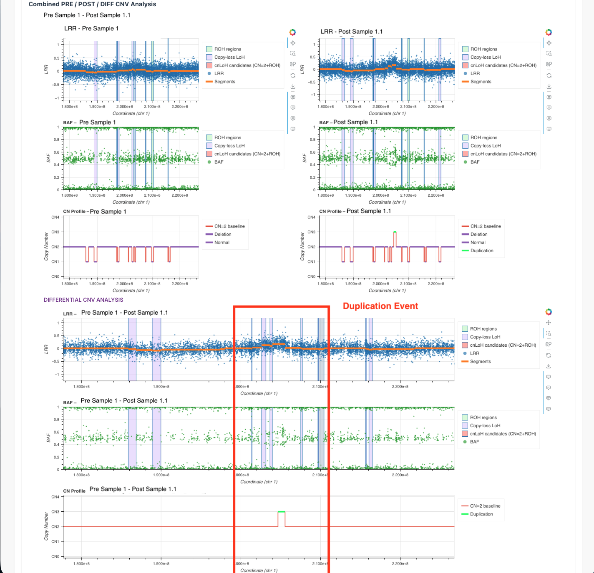

# KaryoPlayground: Interactive Pipeline for Digital Karyotyping with CNV and LoH Detection

[](https://www.nextflow.io/)
[](https://opensource.org/licenses/MIT)
[](https://doi.org/10.5281/zenodo.XXXXXXX)
[](https://docs.conda.io/)
[](https://www.docker.com/)
[](https://sylabs.io/docs/)

A Nextflow-based, containerized pipeline for copy number variation (CNV) and loss of heterozygosity (LoH) analysis from Illumina genotyping arrays, with interactive HTML-based visualization through KaryoPlayground.

---

## Summary

Induced pluripotent stem cells (iPSCs) require routine genomic screening for copy number variations and loss of heterozygosity to ensure quality and safety. Current workflows are fragmented, requiring multiple tools, manual data manipulation, and non-shareable visualizations.

**KaryoPlayground** standardizes this workflow into a single, reproducible pipeline that:
- Performs CNV and LoH analysis from Illumina genotyping array data
- Detects copy-neutral LoH (cnLoH) by overlaying runs of homozygosity with copy number states
- Generates self-contained, interactive HTML reports with synchronized BAF/LRR/CN visualizations
- Enables offline browsing with no additional software requirements
- Ensures reproducibility through Nextflow's containerized workflow management

<div align="center">
  
  
  <br>
  <em>Figure 1: Self-contained interactive report displaying navigation menu, QC summary metrics, and sample overview for paired analysis (left). Interactive demonstration of the dropdown features and navigation (right).</em>
</div>


---

## Key Features

### Analysis Capabilities
- **Dual Analysis Modes**: Single-sample and paired (PRE→POST) analysis with differential views
- **CNV Detection**: Deletions and duplications from BAF/LRR segmentation using bcftools cnv
- **LoH Detection**: Runs of homozygosity (ROH) identification using bcftools roh HMM
- **cnLoH Classification**: Automatic detection of copy-neutral LoH (CN=2 ∩ ROH) and copy-loss LoH (CN<2 ∩ ROH)
- **Quality Control**: Comprehensive QC metrics, IBD analysis, and sample matching

### Interactive Visualization (KaryoPlayground)
- **Multi-page HTML application**: Genome-wide karyograms with synchronized chromosome views
- **Interactive plots**: Pan-and-zoom BAF/LRR/CN tracks with Bokeh integration
- **cnLoH highlighting**: Visual identification of candidate copy-neutral LoH regions
- **Export capabilities**: Per-page Print-to-PDF preserving current zoom/selection; built-in PNG export for publication
- **Searchable tables**: Filterable, sortable CNV and LoH event tables with export functions


*Figure 2: Synchronized PRE (donor) and POST (iPSC) karyograms. CNV segments are color-coded (deletions in blue, duplications in red) with size indicating magnitude and opacity reflecting statistical significance.*

### Reproducibility & Scalability
- **Containerized execution**: Docker, Singularity/Apptainer support
- **Workflow management**: Nextflow DSL2 with automatic provenance tracking
- **HPC-ready**: SLURM templates with optimized resource allocation
- **Version control**: Automatic software version and parameter logging


*Figure 3: Interactive chromosome-level BAF, LRR, and copy number tracks in paired mode. ROH segments and candidate cnLoH regions are highlighted. LRR plots overlay segment boundaries and mean values to aid deviation assessment.*

---

## Statement of Need

Digital karyotyping of iPSC lines is widely practiced, but current workflows suffer from fragmentation. Labs typically:
- Use separate tools for CNV and ROH/LoH analysis
- Manually combine tables, screenshots, and scripts
- Struggle with result sharing and reproducibility
- Lack integrated visualization of BAF, LRR, and copy number states

**KaryoPlayground addresses these challenges by:**
1. **Standardizing analysis**: Single pipeline from raw data to publication-ready results
2. **Integrating interpretation**: Unified visualization of CNV, LoH, and cnLoH in context
3. **Enabling collaboration**: Self-contained HTML reports sharable via email or web
4. **Ensuring reproducibility**: Containerized workflow with complete provenance tracking

### Comparison with Existing Tools

| Feature | KaryoPlayground | PennCNV/QuantiSNP | GenomeStudio | ASCAT |
|---------|----------------|-------------------|--------------|--------|
| Open source | Yes | Yes | No | Yes |
| Paired analysis | Yes | Limited | Limited | Yes (cancer-focused) |
| cnLoH detection | Integrated | Manual | Manual | Yes |
| Interactive visualization | Yes | No | GUI only | No |
| Reproducible workflow | Yes (Nextflow) | Scripts | Manual | Scripts |
| Offline sharing | Yes (HTML) | No | Limited | No |
| Container support | Yes | No | No | Limited |

---

## Installation

### Prerequisites

- **Nextflow** ≥ 24.10.0 ([install guide](https://www.nextflow.io/docs/latest/getstarted.html))
- **Java** ≥ 11
- **Conda**, **Docker**, or **Singularity** for containerization
- **Computing cluster** (recommended for large datasets)

### Quick Setup

```bash
# Install Nextflow (if not already installed)
curl -s https://get.nextflow.io | bash
sudo mv nextflow /usr/local/bin/

# Clone the repository
git clone https://github.com/yourusername/pipeline_digital_karyotyping.git
cd pipeline_digital_karyotyping

# Test installation
nextflow run main.nf --help
```

---

## Usage

### 1. Data Preparation

#### GenomeStudio Exports

Export the following files from Illumina GenomeStudio:
- **Full Data Table** (all samples, all SNPs)
- **Samples Table** (sample metadata)
- **SNP Table** (marker information)
- **PLINK files** (`.ped` and `.map` format)

#### Sample Pairing File

Generate the sample pairing file using preprocessing tools:

```bash
cd preprocessing/
# Edit preprocessing_config.yaml with your file paths
./preprocessing_run.sh
```

**Sample pairing file format** (`sample_sheet.xls`):
```tsv
Sample          Reference
iPSC_clone1     Donor_material1    # Paired analysis
iPSC_clone2     Donor_material2    # Paired analysis
iPSC_clone2     iPSC_clone2        # Single analysis
Control_sample  None               # Single analysis
```

The preprocessing script:
- Validates sample names across all input files
- Detects and corrects naming inconsistencies
- Generates the required pairing file

### 2. Configuration

Create a parameters file from the template:

```bash
cp templates/params.yaml my_project.yaml
```

**Edit key parameters:**
```yaml
# Reference Genome (choose GRCh37 or GRCh38)
PAR: '/path/to/PAR_Coord_GRCh38.txt'
# PAR: '/path/to/PAR_Coord_GRCh37.txt'    # Alternative for GRCh37

fasta: '/path/to/Homo_sapiens.GRCh38.dna.primary_assembly.fa'
# fasta: '/path/to/Homo_sapiens.GRCh37.dna.primary_assembly.fa'  # Alternative for GRCh37

# Project Information
project_ID: 'YOUR_PROJECT_ID'
responsible_person: 'Name_of_the_requester'

# Sample Pairing File (generated by preprocessing/preprocessing_run.sh)
samples_refs: '/path/to/sample_sheet.xls'

# GenomeStudio Exports
manifest: '/path/to/Illumina_manifest.csv'
fullTable: '/path/to/Full_Data_Table.txt'
samplesTable: '/path/to/Samples_Table.txt'
snpTable: '/path/to/SNP_Table.txt'
gsplink: '/path/to/PLINK_directory'        # Directory containing .ped and .map files

# Output Directory
outdir: './results'

# Application Branding (optional)
app_name: 'KaryoPlayground' "controls resulted folder names for 5.0-5.2"
email_helmholtz: 'your-contact@institution.edu'
email_analyst: 'analyst@institution.edu'  # Optional
name_analyst: 'Your Name'                 # Optional
```

### 3. Execution

#### Local Execution (Conda)
```bash
nextflow run main.nf -params-file my_project.yaml -profile conda
```

#### HPC Cluster (SLURM)
```bash
# Copy and edit SLURM template
cp templates/submit.sbatch my_project.sbatch
# Edit paths and resources in my_project.sbatch
sbatch my_project.sbatch
```

#### Docker
```bash
nextflow run main.nf -params-file my_project.yaml -profile docker
```

#### Singularity
```bash
nextflow run main.nf -params-file my_project.yaml -profile singularity
```

---

## Output Structure

The pipeline generates organized results in a hierarchical directory structure:

```
results/
├── README.html                              # Interactive documentation
├── 0.0_information/                         # Pipeline metadata
│   ├── 0.1_pipeline_logs/                   # Process-specific logs
│   ├── 0.2_versions/                        # Software versions
│   └── 0.3_reports/                         # Parameter reports
├── 1.0_quality_control/                     # QC metrics and plots
│   ├── 1.1_QC_results/                      # Call rates, LRR std dev
│   ├── 1.2_single_matching/                 # Genotype correlation
│   ├── 1.3_paired_matching/                 # Paired sample matching
│   └── 1.4_IBD_Analysis/                    # Identity by descent
├── 2.0_preprocess/                          # Data preprocessing
│   ├── 2.1_manifest_reference/              # Reference alleles
│   ├── 2.2_plink/                           # PLINK conversion
│   ├── 2.3_plink_corrected/                 # Corrected VCF
│   └── 2.4_preprocess_vcf/                  # BAF/LRR annotated VCF
├── 3.0_sample_annotation/                   # Sample metadata
├── 4.0_roh_loh_analysis/                    # ROH/LoH detection
│   ├── 4.1_roh_loh_single/                  # Single sample results
│   └── 4.2_roh_loh_paired/                  # Paired sample results
├── 5.0_KaryoPlayground_preprocessing/       # Data for visualization
├── 5.1_KaryoPlayground_unpaired/            # Interactive single results
│   └── KaryoPlayground.html                 # Main application (single)
└── 5.2_KaryoPlayground_paired/              # Interactive paired results
    └── KaryoPlayground.html                 # Main application (paired)
```

### Accessing Interactive Results

Open `results/5.1_KaryoPlayground_unpaired/KaryoPlayground.html` or `results/5.2_KaryoPlayground_paired/KaryoPlayground.html` in a modern web browser (Chrome/Firefox recommended).

**Features:**
- Navigate between samples and chromosomes
- Zoom and pan on BAF/LRR/CN plots
- Highlight and inspect CNV/LoH regions
- Export tables and figures
- Print to PDF preserving current view

**Important:** Keep the HTML file in its directory alongside `samples/` and `components/` folders for proper functionality.

---

## Example Dataset

A detailed guide for testing the pipeline with Illumina's publicly available demo dataset is provided: **[Illumina Demo Dataset Guide (PDF)](docs/illumina_demo_dataset_guide.pdf)**

### Guide Contents

1. **Data Acquisition**: Downloading Illumina Global Screening Array v4.0 demo data
2. **GenomeStudio Processing**: Project setup, sample sheets, data export
3. **Pipeline Execution**: Pre-configured parameters and step-by-step instructions
4. **Results Interpretation**: Example outputs and validation

### Using the Demo Dataset

```bash
# 1. Download Illumina GSA demo data (see PDF guide)
# 2. Process in GenomeStudio (see PDF guide)
# 3. Collect all required data and organize them
# 4. Run pipeline with your adjusted params.yaml file 
nextflow run main.nf -params-file templates/demo_params.yaml -profile conda
```

The demo dataset allows you to:
- Validate installation and environment
- Test the complete workflow end-to-end
- Understand input/output formats
- Compare results with expected outcomes
- Learn data preparation procedures

---

## Performance Benchmarks

**Actual Performance** (from demo_36 dataset):
- **36 samples** (6 paired + 24 unpaired): ~6-7 minutes (with parallel processing)
- **Parallelization**: Sample-level processes run in parallel; execution time is determined by the longest-running process, not cumulative sample count
- **Cluster**: SLURM with normal queue (1 CPU per task)

**Expected Execution Time by Cohort Size***:

| Dataset Size | Samples | Typical Duration** | Peak Memory*** | Storage |
|--------------|---------|-------------------|----------------|---------|
| Small        | 10-20   | ~5-10 minutes     | 8-16 GB        | ~10 GB  |
| Medium       | 30-50   | ~7-15 minutes     | 16-32 GB       | ~25 GB  |
| Large        | 100+    | ~15-30 minutes    | 32-64 GB       | ~50 GB  |

*With Illumina Global Screening Array data on HPC cluster  

**Assuming -resume for cached preprocessing steps; first run may take longer for VCF preprocessing (around + 20 mins, rest of the steps are parallelized)

***Peak memory per parallel task; total cluster allocation depends on concurrent tasks

---

## Documentation

Comprehensive documentation is available in the `docs/` directory:

- **[How_to_run.md](docs/How_to_run.md)**: Complete setup and execution guide
  - Prerequisites and installation
  - Data preparation workflows
  - Configuration parameters
  - Execution examples
  - Troubleshooting
  
- **[Outputs.md](docs/Outputs.md)**: Detailed output descriptions
  - File formats and contents
  - QC metrics interpretation
  - CNV/LoH result tables
  - Interactive visualization guide
  
- **[Changelog.md](docs/Changelog.md)**: Version history and updates

- **[Illumina Demo Dataset Guide](docs/illumina_demo_dataset_guide.pdf)**: Step-by-step tutorial

---

## Citation

If you use KaryoPlayground in your research, please cite:

```bibtex
@article{karyoplayground2025,
  title={KaryoPlayground: Interactive Pipeline for Digital Karyotyping with CNV and LoH Detection},
  author={Dura, Ugur and Pastor, Xavier and Walzthoeni, Thomas and Boos, Alena},
  journal={Journal of Open Source Software},
  year={2025},
  publisher={The Open Journal},
  doi={10.21105/joss.XXXXX}
}
```

### Key References

**CNV and LoH Detection Methods:**
```bibtex
@article{danecek2016bcftools,
  title={BCFtools/RoH: a hidden Markov model approach for detecting autozygosity from next-generation sequencing data},
  author={Danecek, Petr and others},
  journal={PLoS ONE},
  volume={11},
  number={4},
  pages={e0155014},
  year={2016},
  doi={10.1371/journal.pone.0155014}
}
```

**Workflow Management:**
```bibtex
@article{ditommaso2017nextflow,
  title={Nextflow enables reproducible computational workflows},
  author={Di Tommaso, Paolo and others},
  journal={Nature Biotechnology},
  volume={35},
  number={4},
  pages={316--319},
  year={2017},
  doi={10.1038/nbt.3820}
}
```

---

## Contributing

We welcome contributions! Please see our [CONTRIBUTING.md](CONTRIBUTING.md) for:
- Bug reporting guidelines
- Feature request process
- Code contribution workflow
- Development setup
- Testing procedures

### Quick Start for Contributors

```bash
# Clone and create development branch
git clone https://github.com/yourusername/pipeline_digital_karyotyping.git
cd pipeline_digital_karyotyping
git checkout -b feature/your-feature-name

# Run tests
nextflow run tests/test_pipeline.nf -profile test

# Submit pull request
git push origin feature/your-feature-name
```

---

## Community & Support

### Getting Help

- **Issues**: Report bugs or request features via [GitHub Issues](https://github.com/yourusername/pipeline_digital_karyotyping/issues)
- **Discussions**: Ask questions in [GitHub Discussions](https://github.com/yourusername/pipeline_digital_karyotyping/discussions)
- **Email**: For private inquiries, contact bioinformatics-core@helmholtz-munich.de

### Reporting Bugs

Please include:
1. Nextflow version (`nextflow -version`)
2. Execution profile used (conda/docker/singularity)
3. Error messages and log files
4. Minimal reproducible example

### Feature Requests

Describe:
1. Use case and motivation
2. Proposed solution
3. Expected behavior
4. Alternative approaches considered

---

## Authors & Acknowledgments

### Development Team

**Nextflow Pipeline Implementation:**
- **Ugur Dura** -  Helmholtz Munich
- **Xavier Pastor** -  Helmholtz Munich
- **Dr. Thomas Walzthoeni** - Helmholtz Munich
- **Dr. Alena Boos** - Helmholtz Munich

**Original Algorithm Development:**
- **Dr. Lucia Trastulla** - CNV Detection Algorithm (Max Planck Institute for Psychiatry)
- **Dr. Laura Jiménez Barrón** - Initial Pipeline Development (Max Planck Institute for Psychiatry)
- **Prof. Dr. Michael Ziller** - Scientific Supervision (Max Planck Institute for Psychiatry)
- **Prof. Dr. Elisabeth Binder** - Scientific Supervision (Max Planck Institute for Psychiatry)

### Institutional Support

- **Helmholtz Zentrum München** - Core Facility Bioinformatics and Statistics
- **Max Planck Institute for Psychiatry** - Original algorithm development

---

## Technical Details

### Software Dependencies

**Core Tools:**
- Nextflow ≥ 24.10.0 - Workflow management
- bcftools ≥ 1.15 - CNV calling (bcftools cnv, bcftools roh)
- PLINK v1.90 - Genotype data manipulation
- VCFtools ≥ 0.1.16 - VCF processing

**Programming Languages:**
- R ≥ 4.0.0 - Statistical computing
- Python ≥ 3.8 - Data processing
- Bokeh ≥ 3.0 - Interactive visualization

**Documentation:**
- Pandoc ≥ 2.19 - Report generation

Full dependency specifications with exact versions are available in the `env/` directory conda environment files. Pipeline is also capable to create required environments based on these env configs during the runtime. 

### Computational Requirements

**Minimum Configuration:**
- 4 CPU cores
- 16 GB RAM
- 50 GB storage

### Container Images

--> Pre-built containers can be included ???

- **Docker Hub**: `username/karyoplayground:latest`

---

## License

This project is licensed under the **MIT License** - see the [LICENSE](LICENSE) file for details.

### Third-Party Components

- **CNV detection**: Adapted from bcftools/RoH (MIT/Expat License)
- **Original pipeline**: Based on MPIP CNV Detection (GPL-3.0)
- **Interactive plots**: Bokeh (BSD 3-Clause License)

---

## References

1. Danecek, P., et al. (2016). BCFtools/RoH: a hidden Markov model approach for detecting autozygosity from next-generation sequencing data. *PLoS ONE*, 11(4), e0155014. https://doi.org/10.1371/journal.pone.0155014

2. Di Tommaso, P., et al. (2017). Nextflow enables reproducible computational workflows. *Nature Biotechnology*, 35(4), 316-319. https://doi.org/10.1038/nbt.3820

3. Takahashi, K., & Yamanaka, S. (2006). Induction of pluripotent stem cells from mouse embryonic and adult fibroblast cultures by defined factors. *Cell*, 126(4), 663-676.

4. Hussein, S. M., et al. (2011). Copy number variation and selection during reprogramming to pluripotency. *Nature*, 471(7336), 58-62.

5. Wang, K., et al. (2007). PennCNV: an integrated hidden Markov model designed for high-resolution copy number variation detection in whole-genome SNP genotyping data. *Genome Research*, 17(11), 1665-1674.

---

## Disclaimer

This software is provided "as is" without warranty of any kind. While thoroughly tested, users should validate results for their specific applications. The authors are not responsible for any damages or loss of information.

**For research use only. Not approved for clinical diagnostic purposes.**

---

## Project Status

- **Version**: 1.0
- **Status**: Active Development
- **Last Updated**: 2025
- **Repository**: https://github.com/yourusername/pipeline_digital_karyotyping
- **Documentation**: https://pipeline-digital-karyotyping.readthedocs.io/

---

## Quick Links

- [Installation](#installation)
- [Usage Guide](#usage)
- [Example Dataset](#example-dataset)
- [Documentation](docs/)
- [Issue Tracker](https://github.com/yourusername/pipeline_digital_karyotyping/issues)
- [Release Notes](docs/Changelog.md)
- [Contributing](CONTRIBUTING.md)
- [License](LICENSE)
